# Web编程第一次项目报告

| 课程名称：Web编程 | 项目名称：新闻爬虫及展示 | 指导老师：王晔 |
| ----------------- | ------------------------ | -------------- |
| **姓名：郑佳辰**  | **学号：10182100359**    | **年级：2018** |

## 实验要求

新闻爬虫及爬取结果的查询网站

核心需求：

1. 选取代表性的新闻网站（比如新浪新闻、网易新闻等，或者某个垂直领域权威性的网站比如经济领域的雪球财经、东方财富等，或者体育领域的腾讯体育、虎扑体育等等）建立爬虫，针对不同网站的新闻页面进行分析，爬取出编码、标题、作者、时间、关键词、摘要、内容、来源等结构化信息，存储在数据库中。

2. 建立网站提供对爬取内容的分项全文搜索，给出所查关键词的时间热度分析。

技术要求：

1. 必须采用Node.JS实现网络爬虫

2. 必须采用Node.JS实现查询网站后端，HTML+JS实现前端（尽量不要使用任何前后端框架）

## 爬虫部分

### 网页分析

首先分析将要爬取的新闻网页。在网站上按F12键可以查看要爬取的网页的源码，利用代码栏左上角的“审视网页中的要素”按钮，在网页上选择想要审视的要素，就可以看到该要素对应的html源代码。利用这个方式，我们可以确定要爬取的内容的格式。

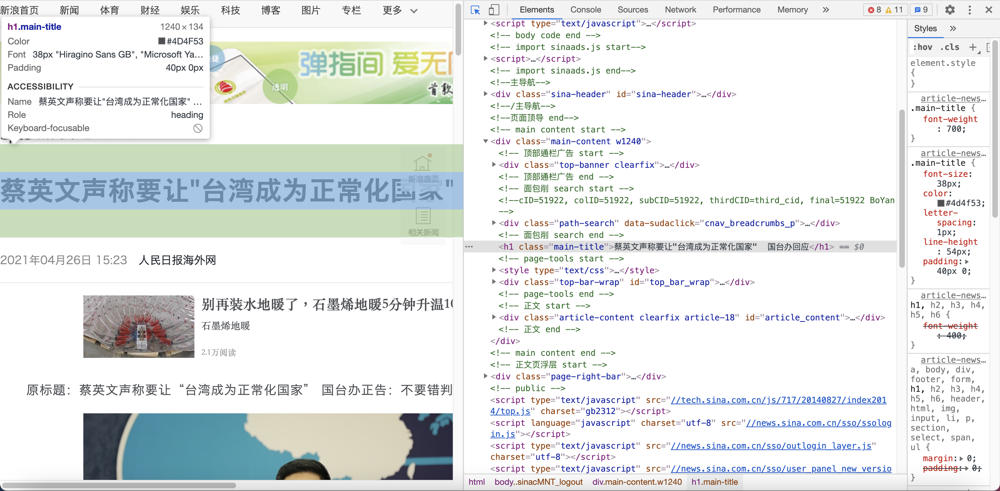

新浪新闻的主页是我们本次爬取的种子页面，我们将解析出这个页面上的新闻页面超链接并对这些新闻页面进行爬取。其网页代码如下图所示，我们要爬取这个页面中的新闻页面的超链接。

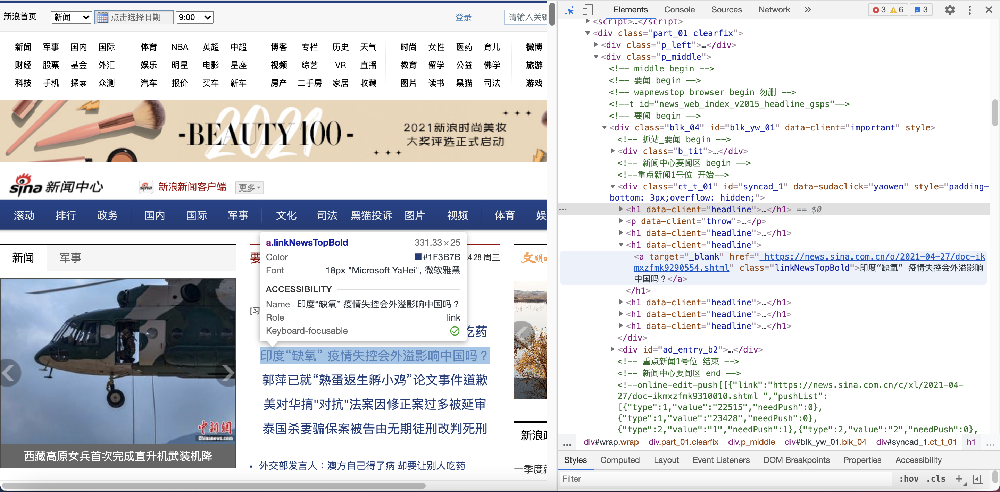

### 使用的工具包

然后我们开始编写爬虫，这里以新浪新闻为例。首先加载好需要用到的库和文件。其中，**request库**是一个简单的客户端，用于发送http请求。**cheerio库**是为服务器端实现的一个快速敏捷的Jquery核心库，在这个项目里用来解析html。**iconv-lite库**可以将编码格式由GBK转为UTF-8，转换后的html就可以用cheerio解析。**fs库**是file system library的意思，是用来读取本地文件的。**date-utils库**用于转换日期格式。**node-schedule库**用来完成定时器功能。此外还使用了这个文件中未显示的**mongodb库**用于连接数据库并进行CRUD操作。

```javascript
var fs = require('fs');
var myRequest = require('request');
var myCheerio = require('cheerio');
var myIconv = require('iconv-lite');
require('date-utils');
var mongo = require('./mongodb.js');
var schedule = require('node-schedule');

var source_name = "新浪新闻";
var myEncoding = "utf-8";
var seedURL = 'http://news.sina.com.cn/';
```

### 爬虫整体结构

存放爬虫的文件夹下爬虫文件的整体结构如下图所示，各个爬虫文件之间没有耦合，可以分开运行。

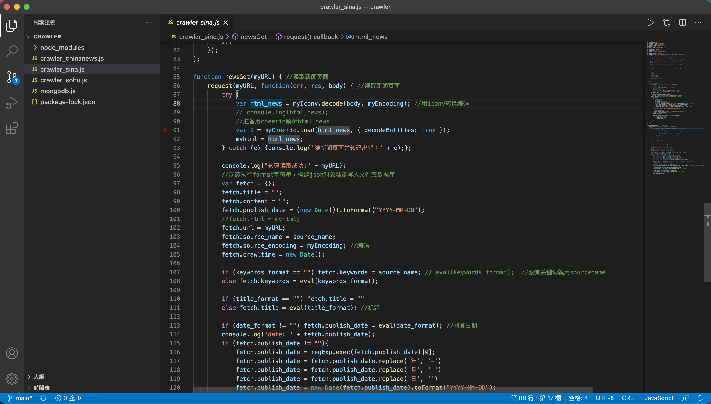

在对网站进行分析之后，我们需要定义要爬取的各要素的爬取格式，根据网站的不同，爬取格式也不尽相同。这里给出新浪新闻的对应变量。其中，本段代码第一行的变量是从网站中爬取超链接的表达式，该语句在大多数网站上通用。本段代码末尾的正则表达式用于匹配新闻网页对应的URL，不同的新闻网站对应的新闻页面的格式大相径庭，对应的正则表达式也天差地别。如果该表达式不能很好匹配新闻网页，就只能在之后的操作中将不是新闻网页的链接忽略，处理起来很麻烦。

```javascript
var seedURL_format = "$('a')";
var keywords_format = "$('meta[name=\"keywords\"]').eq(0).attr(\"content\")";
var title_format = "$('title').text()";
var date_format = "$('span.date').text()";
var author_format = "$('p.article-editor').text()";
var content_format = "$('div.article').text()";
var desc_format = " $('meta[name=\"description\"]').eq(0).attr(\"content\")";
var source_format = "$('span.source-nolink ent-source source').text()";
var url_reg = /.*\/(\d{4})-(\d{2})-(\d{2})\/.*(\d{7}).shtml/;
```

搜狐新闻对应的爬取格式和正则表达式也附于下方，可以看到两个网站的爬虫的差异。

```javascript
var seedURL_format = "$('a')";
var keywords_format = " $('meta[name=\"keywords\"]').eq(0).attr(\"content\")";
var title_format = "$('title').text()";
var date_format = "$('#pubtime_baidu').text()";
var author_format = "$('#editor_baidu').text()";
var content_format = "$('.left_zw').text()";
var desc_format = " $('meta[name=\"description\"]').eq(0).attr(\"content\")";
var source_format = "$('#source_baidu').text()";
var url_reg = /\/(\d{4})\/(\d{2})-(\d{2})\/(\d{7}).shtml/;
```

然后编写请求函数request，函数内部需要使用适当的headers构造请求并**调用request库**发送给URL。这里的请求是异步执行的，这是node.js开发的特性之一，这样可以并发地向网站发出更多的请求，执行速度更快。这也是node.js适合用来编写爬虫的特点之一。

```javascript
//防止网站屏蔽我们的爬虫
var headers = {
    'User-Agent': 'Mozilla/5.0 (Macintosh; Intel Mac OS X 10_10_1) AppleWebKit/537.36 (KHTML, like Gecko) Chrome/39.0.2171.65 Safari/537.36'
}

//request模块异步fetch url
function request(url, callback) {
    var options = {
        url: url,
        encoding: null,
        headers: headers,
        timeout: 10000 
    }
    myRequest(options, callback)
};
```

由于之后要进行时间热度分析，所以我们为爬虫加上定时执行的功能，保证每天执行两次。利用node-schedule库设置执行爬虫的小时数和分钟数。每天一到设定的时间，我们就调用seedget函数，开始爬取网站。

```javascript
//！定时执行
var rule = new schedule.RecurrenceRule();
var times = [0, 12]; //每天2次自动执行
var times2 = 5; //定义在第几分钟执行
rule.hour = times;
rule.minute = times2;

//定时执行httpGet()函数
schedule.scheduleJob(rule, function() {
    seedget();
});
```

接着介绍seedget函数，这个函数用于从种子页面中取出新闻页面的超链接并访问新闻页面。函数内我们首先给种子网站发送一个请求，然后**使用iconv-lite库**转换编码并**使用cherrio库**解析html。解析完成后我们使用eval语句得到html里所有超链接，这就是种子页面指向的所有网页。对于每个网页链接，首先需要为其补全开头，然后用前述正则表达式检验这个URL是否符合该网站新闻页面的格式，最后查找这个网页是否已经被爬取并存储到数据库里。如果都符合条件，那么调用newsGet函数爬取新闻页面。

```javascript
· seedget() {
    request(seedURL, function(err, res, body) { //读取种子页面
        try {
            //用iconv转换编码
            var html = myIconv.decode(body, myEncoding);
            //console.log(html);
            //准备用cheerio解析html
            var $ = myCheerio.load(html, { decodeEntities: true });
        } catch (e) { console.log('读种子页面并转码出错：' + e) };
        var seedurl_news;
        try {
            seedurl_news = eval(seedURL_format);
        } catch (e) { console.log('url列表所处的html块识别出错：' + e) };
        seedurl_news.each(function(i, e) { //遍历种子页面里所有的a链接
            var myURL = "";
            try {
                //得到具体新闻url
                var href = "";
                href = $(e).attr("href");
                if (href == undefined) return;
                if (href.toLowerCase().indexOf('http://') >= 0) myURL = href; //http://开头的
                else if (href.startsWith('//')) myURL = 'http:' + href; ////开头的
                else myURL = seedURL.substr(0, seedURL.lastIndexOf('/') + 1) + href; //其他

            } catch (e) { console.log('识别种子页面中的新闻链接出错：' + e) }

            if (!url_reg.test(myURL)) return; //检验是否符合新闻url的正则表达式
            if (not_url_reg.test(myURL)) return;
             
            mongo.search_web({"url":myURL}, {}, {}, function(result){
                // console.log(result);
                if (result.length == 0){
                    newsGet(myURL); 
                }
            });
        });
    });
};
```

下面的newsGet函数用于从新闻页面中获取我们需要的数据。首先我们利用之前的request函数读取新闻页面，然后和之前一样**使用iconv-lite库**转换编码并**使用cherrio库**解析html。然后动态执行format字符串，从html中找出我们需要爬取的信息。这里需要注意，根据多次爬取结果可以看出，如果一个页面并没有日期这一项，那么它大概率不是新闻网页。因为新闻具有时效性，它的时间非常重要。将飞新闻网页储存到数据库中会破坏原有数据的格式，同时一旦处理不当就会造成程序错误而停止。所以在代码中有一个很长的if语句，他的作用是如果发现网页并没有日期这一项，就直接停止执行后面的内容。执行过format字符串爬取到需要的信息之后，我们就可以将这些信息插入到数据库中，该网页的爬取也宣告完毕。

```javascript
function newsGet(myURL) { //读取新闻页面
    request(myURL, function(err, res, body) { //读取新闻页面
        try {
            var html_news = myIconv.decode(body, myEncoding); //用iconv转换编码
            // console.log(html_news);
            //准备用cheerio解析html_news
            var $ = myCheerio.load(html_news, { decodeEntities: true });
            myhtml = html_news;
        } catch (e) {console.log('读新闻页面并转码出错：' + e);};

        console.log("转码读取成功:" + myURL);
        //动态执行format字符串，构建json对象准备写入文件或数据库
        var fetch = {};
        fetch.title = "";
        fetch.content = "";
        fetch.publish_date = (new Date()).toFormat("YYYY-MM-DD");
        //fetch.html = myhtml;
        fetch.url = myURL;
        fetch.source_name = source_name;
        fetch.source_encoding = myEncoding; //编码
        fetch.crawltime = new Date();

        if (keywords_format == "") fetch.keywords = source_name; // eval(keywords_format);  //没有关键词就用sourcename
        else fetch.keywords = eval(keywords_format);

        if (title_format == "") fetch.title = ""
        else fetch.title = eval(title_format); //标题

        if (date_format != "") fetch.publish_date = eval(date_format); //刊登日期   
        console.log('date: ' + fetch.publish_date);
        if (fetch.publish_date != ""){   
            fetch.publish_date = regExp.exec(fetch.publish_date)[0];
            fetch.publish_date = fetch.publish_date.replace('年', '-')
            fetch.publish_date = fetch.publish_date.replace('月', '-')
            fetch.publish_date = fetch.publish_date.replace('日', '')
            fetch.publish_date = new Date(fetch.publish_date).toFormat("YYYY-MM-DD");

            if (author_format == "") fetch.author = source_name; //eval(author_format);  //作者
            else fetch.author = eval(author_format);
    
            if (content_format == "") fetch.content = "";
            else fetch.content = eval(content_format).replace("\r\n" + fetch.author, ""); //内容,是否要去掉作者信息自行决定
    
            if (source_format == "") fetch.source = fetch.source_name;
            else fetch.source = eval(source_format).replace("\r\n", ""); //来源
    
            if (desc_format == "") fetch.desc = fetch.title;
            else fetch.desc = eval(desc_format).replace("\r\n", ""); //摘要  
            
            mongo.insert_web(fetch); 
        }
    });
}
```

之后就可以点击三角形按钮运行爬虫，新浪新闻的爬虫运行时的日志信息如图所示。

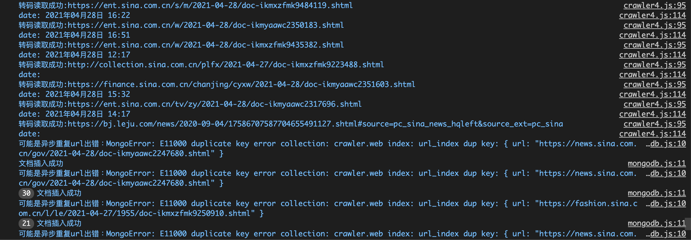

搜狐新闻的爬虫运行时的日志类似，可以看到网站链接，日期等要素格式的不同。

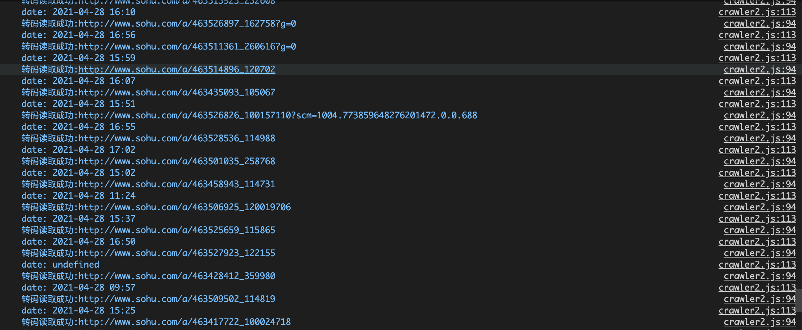

由上述爬虫代码的介绍可以看出，为了判断一个页面是否是新闻页面，我们使用了多种方法去筛选。首先是使用正则表达式判断网页URL的格式，其次是利用nodejs自带的try语句判断该网页是否可以被爬取，最后是利用各字符串是否为空来判别新闻网站。即使这样，依然会有不是新闻网站的网页被爬取，如新浪游戏的广告页面。判断新闻更为准确的方法也可以使用自然语言处理的方法，但那样就有些小题大做了。这使得我们爬取到的新闻数据虽然具有一定结构化，但也需要进行大量预处理。尤其在爬取了多个接口不同的网站的情形下，数据格式不一定统一，这时更需要进行数据清洗，才能更好地进行数据分析等工作。

### 数据库设计

在本次爬虫项目中，我们选择了文档型数据库**mongoDB**来存储爬取的数据。MongoDB使用起来简单便捷，查询结果便于转换为Array和Json格式，并且支持存储多媒体文件。使用nodejs访问数据库MongoDB的代码如下，我们需要**调用mongodb库**用于与数据库交互。我们将访问MongoDB的接口封装成函数并放入单独的文件中，便于调用。这里主要需要用到插入和查询两个函数，两个函数的结构大致相同。首先连接Mongo客户端，然后选择要访问的数据集，对这些数据集进行CRUD操作，并将返回的结果通过回调函数返回给主程序。

```javascript
var MongoClient = require('mongodb').MongoClient;
var url = "mongodb://localhost:27017/";

var insert_web = function(webjson) {
    MongoClient.connect(url, function(err, db) {
        if (err) throw err;
        var dbo = db.db("crawler");
        try{
            dbo.collection("web").insertOne(webjson, function(err, res) {
                if (err) console.log('可能是异步重复url出错：' + err);
                console.log("文档插入成功");
                db.close();
            });
        } catch (e) { console.log('可能是异步重复url出错：' + e) };
    });
};

var search_web = function(webjson, coljson, seqjson, callback) {
    MongoClient.connect(url, function(err, db) {
        if (err) console.log('查询出错：' + err);
        var dbo = db.db("crawler");
        dbo.collection("web").find(webjson).project(coljson).sort(seqjson).toArray(function(err, result) { // 返回集合中所有数据
            if (err) throw err;
            // console.log(result);
            db.close();
            callback(result);
        });
    });
};

exports.insert_web = insert_web;
exports.search_web = search_web;
```

数据库如下图所示，可以看到数据库中存储了我们爬取的网站的字段。每一个网页爬取下来的信息作为一个文档，所有的这些文档组成一个文档集。每个文档由_id字段唯一标识，它会在文档被加入加上之前爬取的许多中国新闻网的新闻爬取的新闻**总数达到了接近2700多条**。其中，每天第一次运行每个爬虫可爬取约200条新闻。

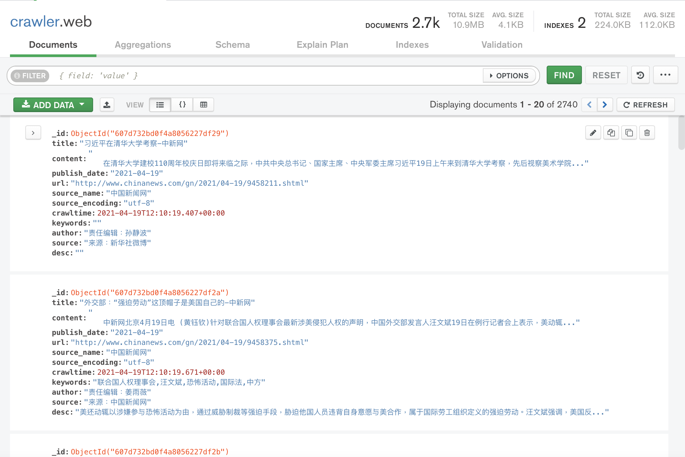

由于我使用的是文档型数据库，所以没有设置主键，由_id字段唯一标识。同时，我在数据库的物理设计环节添加了url字段的唯一索引，主要是因为在爬虫里经常需要根据url查找文档。另一方面，将其设置为唯一索引也可以使得爬取的网页不重复。由下图可知，该索引的使用次数还是很高的。

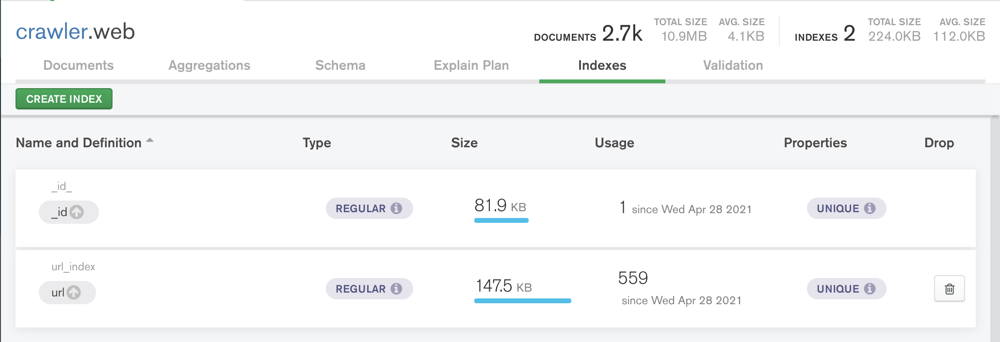

## 搜索网站部分

首先安装好express库，并输入`express –e search_site`新建名为search_site的项目。注意`npm install express`命令会将库安装至当前目录而不是根目录下，这时可能提示找不到express库。出现这种情况时，可以使用`sudo npm install -g express`将express安装到系统文件夹中，这样就可以为express库自动配置环境变量，从而解决这个问题。然后编写html和js文件，这里将分功能介绍网站的编写。搜索网站的大致结构如下图左栏所示。

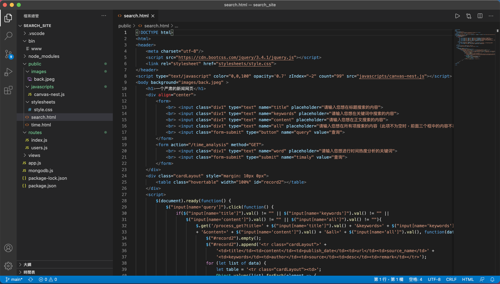

### 搜索功能

首先是最主要的对新闻进行搜索的功能。首先从seach.html网页的表单中接收需要查询的单词，共有4个文本框，前三个分别用来从标题，关键词，正文中匹配用户搜索的内容。第四个用来从几乎所有字段中搜索用户输入的内容。当用户点击按钮之后，用户输入的数据在前端会使用javascript进行进一步处理，然后发送给后端进行处理。处理过之后即可渲染最下方的表格，展示搜索结果。

```html
    <h1>一个严肃的新闻网页</h1>
    <div align="center">
        <form>
            <br> <input class="div1" type="text" name="title" placeholder="请输入您想在标题搜索的内容">
            <br> <input class="div1" type="text" name="keywords" placeholder="请输入您想在关键词中搜索的内容">
            <br> <input class="div1" type="text" name="content" placeholder="请输入您想在正文搜索的内容">
            <br> <input class="div1" type="text" name="all" placeholder="请输入您想在所有项搜索的内容（此项不为空时，前面三个框中的内容不再查询）">
            <br> <input class="form-submit" type="button" name="query" value="查询">
        </form>
      ...
    </div>
    <div class="cardLayout" style="margin: 10px 0px">
        <table class="hovertable" width="100%" id="record2"></table>
    </div>
```

在用户点击查询按钮之后，前端首先会判断用户的请求是否全部为空。如果是，那么很可能是误触，这是不需要向后方继续发送请求。否责就构造链接，利用get方法向后端传递参数。同时，前端代码在得到后端送来的查询结果之后，再渲染表格，在其之后添加行和单元格，用以展示查询结果。

```javascript
    <script>
        $(document).ready(function() {
            $("input[name='query']").click(function() {
                if($("input[name='title']").val() != "" || $("input[name='keywords']").val() != "" ||
                    $("input[name='content']").val() != "" || $("input[name='all']").val() != ""){
                        $.get('/process_get?title=' + $("input[name='title']").val() + '&keywords=' + $("input[name='keywords']").val() 
                        + '&content=' + $("input[name='content']").val() + '&all=' + $("input[name='all']").val(), function(data) {
                            $("#record2").empty();
                            $("#record2").append('<tr class="cardLayout">' +
                                '<td>title</td><td>content</td><td>publish_date</td><td>url</td><td>source_name</td>' +
                                '<td>keywords</td><td>author</td><td>source</td><td>desc</td><td>remark</td></tr>');
                            for (let list of data) {
                                let table = '<tr class="cardLayout"><td>';
                                Object.values(list).forEach(element => {
                                    table += (element + '</td><td>');
                                });
                            $("#record2").append(table + '</td></tr>');
                        }
                    });
                }
            });
        });
    </script>
```

搜索功能的后端相对来说比较简单，只需要根据传来的参数构造适当的查询语句，然后调用之前已经写好的MongoDB的查询接口，并在回调函数中构造response返回给前端即可。

```javascript
router.get('/process_get', function(request, response) {
    var or_array = [];
    if(request.query.title!="")
        or_array.push({"title":{"$regex":request.query.title}})
    if(request.query.keywords!="")
        or_array.push({"keywords":{"$regex":request.query.keywords}})
    if(request.query.content!="")
        or_array.push({"content":{"$regex":request.query.content}})
    if(request.query.all!="")
        or_array=[{"title":{"$regex":request.query.all}}, {"keywords":{"$regex":request.query.all}}, 
                {"content":{"$regex":request.query.all}}, {"desc":{"$regex":request.query.all}}, 
                {"source_name":{"$regex":request.query.all}}, {"publish_date":{"$regex":request.query.all}}]
    var que = {"$or":or_array};
    var col = {"_id":0, "source_encoding":0, "crawltime":0};
    var seq = {"publish_date": -1};

    mongo.search_web(que, col, seq, function(result){
        response.writeHead(200, {
            "Content-Type": "application/json"
        });
        response.write(JSON.stringify(result));
        response.end();
    });
});
```

查询结果的展示如图所示。首先查找标题中含中国的新闻。

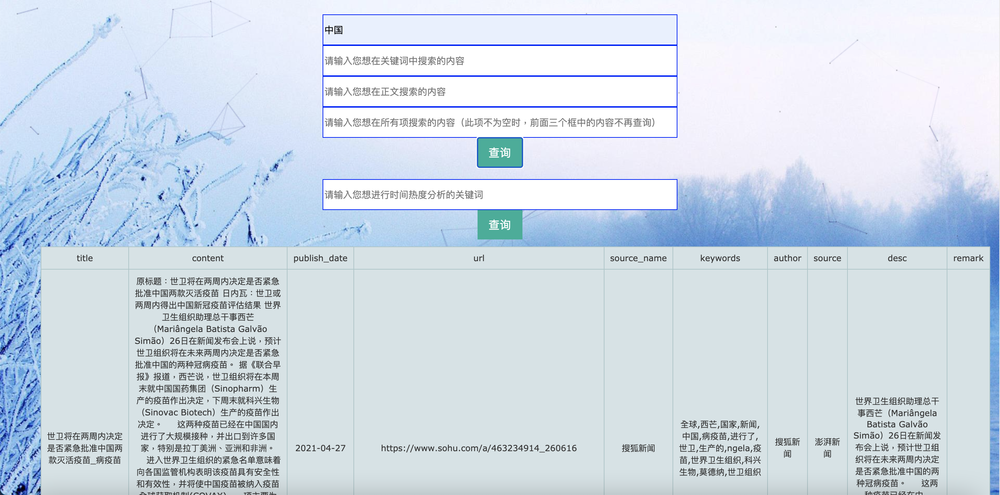

之后查找关键字中含历史的新闻。

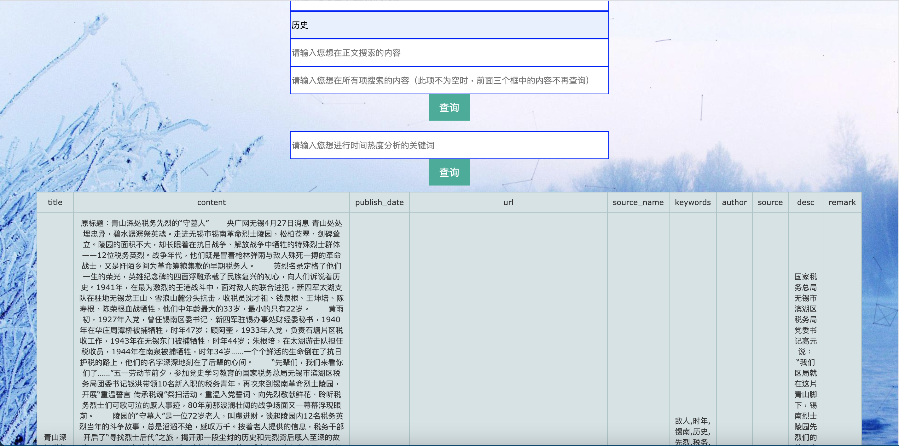

当前三个文本框中有多于一个有查询内容时，网页会查询它们的并集。

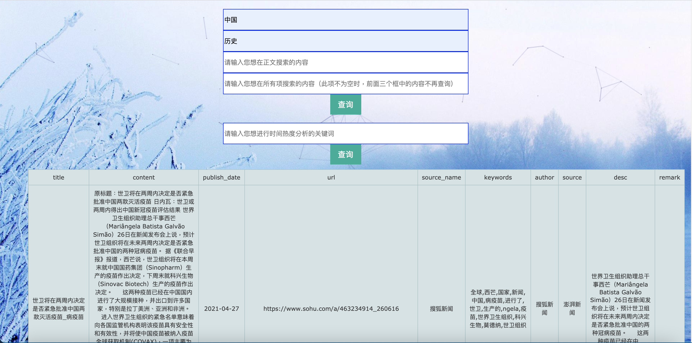

在正文中搜索含有数字4096的新闻。

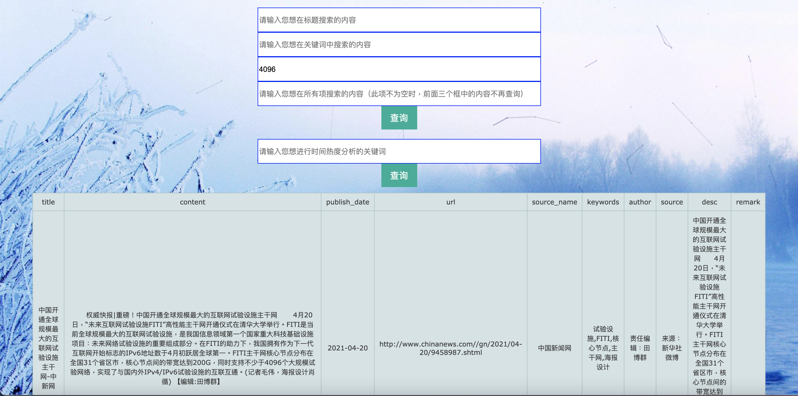

最后是查询所有字段中的日期。

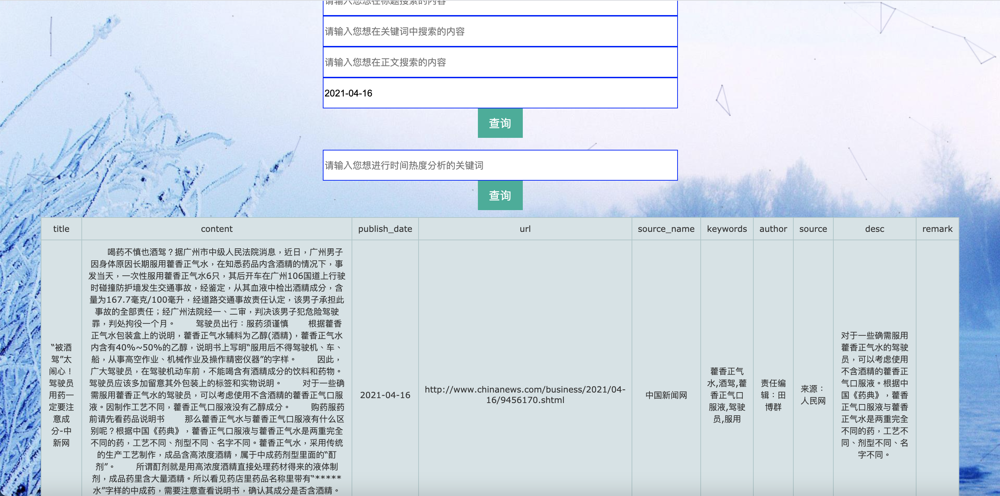

### 网页美化

之后我们可以对网页进行美化。在建立express项目时，public目录下已有3个子目录。其中images用于存放网站用到的所有图片，javascripts文件夹用于存放前端页面用到的js文件，stylesheets文件夹用于存放css文件。首先我们给出search.html的headers部分，如下所示。

```html
<header>
    <meta charset="utf-8"/>
    <script src="https://cdn.bootcss.com/jquery/3.4.1/jquery.js"></script>
    <link rel="stylesheet" href="stylesheets/style.css">
</header>
<script type="text/javascript" color="0,0,100" opacity='0.7' zIndex="-2" count="99" src="javascripts/canvas-nest.js"></script>
<body background="images/back.jpeg" >
  ...
```

首先，在body中设置了网页的背景图片，原图存放在images路径下。两句script文件分别对应了调用javascript的两种形式，调用网络上的js文件或调用本地的js文件。这里使用了一个开源前端项目平台即[BootCDN](www.bootcdn.cn)，需要注意的是这个网站可能连接不上（在之前的项目中遇到过一次，当时还排查了良久，后来挂了梯子），如果此时调用网络上的js文件，则在无法连接到该js。header之后的script的src属性不是网络上的地址而是本地的js，该文件为网页家了一个鼠标跟随特效。该特效参考了以下博客：[好玩的js代码，canvas-nest.js](https://blog.csdn.net/wang0112233/article/details/80064109)。

header中link行中连接了当前页面使用的css，css可以静态地修饰网页，让html更加美观。我的CSS文件如下图所示。其中，body中的fixed使得背景图不会岁滚轮上下滚动。div1指定了文本框的样式，table.hovertable指定了表格的样式，h1指定了标题的样式。

```css
body {
  padding: 50px;
  font: 14px "Lucida Grande", Helvetica, Arial, sans-serif;
  text-align: center;
  background-attachment: fixed; 
  background-size:100%;
}

a {
  color: #00B7FF;
}

.div1 {
  width: 500px;
  height: 40px;
  border: 1px solid blue;
}

.form-submit {
  background-color: #00af98; 
  border: none;
  color: white;
  padding: 10px 16px;
  text-align: center;
  text-decoration: none;
  display: inline-block;
  font-size: 16px;
}

table.hovertable {
  font-family: verdana,arial,sans-serif;
  font-size:11px;
  color:#333333;
  border-width: 1px;
  border-color: #999999;
  border-collapse: collapse;
}
table.hovertable th {
  background-color:#c3dde0;
  border-width: 1px;
  padding: 8px;
  border-style: solid;
  border-color: #a9c6c9;
}
table.hovertable tr {
  background-color:#d4e3e5;
}
table.hovertable td {
  border-width: 1px;
  padding: 8px;
  border-style: solid;
  border-color: #a9c6c9;
}

h1 {
  border-radius: 6px 6px 6px 6px;
  color: #00aeff;
  font-family:"微软雅黑", "宋体", "黑体", Arial;
  font-size: 30px;
  font-weight: bold;
  height: 25px;
  line-height: 25px;
  margin: 18px 0 ;
  padding: 8px 0 5px 5px;
  text-shadow: 2px 2px 3px #808080;
}

```

最终搜索页面的效果如图所示。


### 时间热度分析

时间热度分析功能实现如下，我实现的版本是可以从网页读取关键词，并返回该关键词每天的出现次数。首先在搜索页面中增加一个表单，用于接受需要进行时间热度分析的关键词，之后跳转到处理请求并显示分析结果的页面。这里使用的input类型是submit。它和button最大的不同在于它将提交表单的动作集成了，更具体的区别和用法可以查看这个博客：[submit和button的区别](https://blog.csdn.net/aiming66/article/details/79046432)。这里点击按钮之后，它会将表单中的内容传到action指定的链接。

```html
        <form action="/time_analysis" method="GET">
            <br> <input class="div1" type="text" name="word" placeholder="请输入您想进行时间热度分析的关键词">
            <br> <input class="form-submit" type="submit" name="timaly" value="查询">
        </form>
```

然后在后端对关键词进行处理，首先利用**cheerio库**加载好原始的html，然后利用渲染的方法将标题替换掉，这样可以在标题中显示出关键词。然后判断其是否为空，如果为空就不做处理，否则查询出包含有该关键词的新闻的日期。之后利用map统计每个日期下新闻出现的次数，并再次利用渲染的方法将每一行添加到表格中。最后向response输出html即可。

```javascript
router.get('/time_analysis', function(request, response) {
    let $ = cheerio.load(fs.readFileSync("public/time.html"));
    $("h1#kw").replaceWith(`<h1 id="kw">关键词 ${request.query.word} 的时间热度分析</h1>`);
    if(request.query.word==""){
        // response.write(JSON.stringify("no value"));
        $("table#tb").append(`<tr><td>NONE</td><td>0</td></tr>`);
        response.end(
            $.html()
        );
    } else {
        var que = {"keywords":{"$regex":request.query.word}};
        var col = {"_id":0, "publish_date":1};
        var seq = {"publish_date": -1};

        mongo.search_web(que, col, seq, function(result){
            // response.write(JSON.stringify(result));
            var m = new Map();
            for(var i = 0; i < result.length; i++){
                var date = result[i].publish_date;
                var temp = 0;
                if(m.has(date))
                    temp = m.get(date);
                m.set(date, temp + 1);
            }
            let obj= Object.create(null);
            for (let[k,v] of m) {
                obj[k] = v;
                $("table#tb").append(`<tr><td>${k}</td><td>${v}</td></tr>`);
            }
            // response.write(JSON.stringify(obj));
            response.end(
                $.html()
            );
        });
    }
});

```

对应的展示页面time.html的body部分如下所示，标题中的word会被cheerio库渲染并替换进去，下方的表格同样会使用渲染的方法进行补充。这个页面的其他部分与查询页面大致相同，不再赘述。

```html
<body background="images/back.jpeg" >
    <h1 id="kw">关键词 {{ word }} 的时间热度分析</h1>
    <div align="center">
    </div>
    <div class="cardLayout" style="margin: 10px 0px">
        <table class="hovertable" width="100%" id="record2"></table>
    </div>
    <table id="tb" class="hovertable" align="center">
        <tr><td>date</td><td>times</td></tr>
    </table>
</body>
```

最终的时间热度分析的展示效果如图所示。


### 网站运行

在编写好各种动态和静态文件之后，在项目根目录下输入`npm start`即可运行查询网站，运行时的部分日志信息如下图所示。

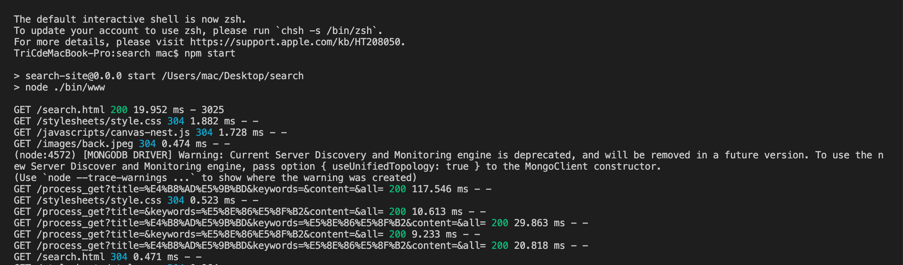

## 代码链接

目前我的代码已上传至Github，链接为：https://github.com/ChiachenCheng/NewsCrawler

